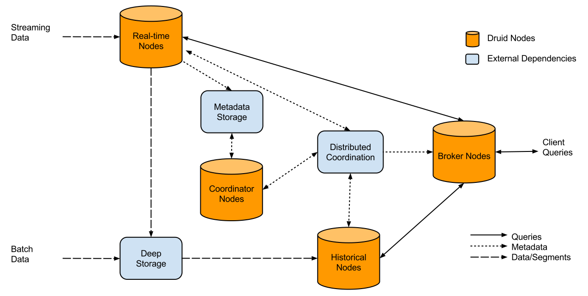

```{r, include=FALSE}
htmltools::tagList(rmarkdown::html_dependency_font_awesome())
library(knitr)
opts_chunk$set(
	comment = "",
	fig.width = 12, 
	message = FALSE,
	warning = FALSE,
	tidy.opts = list(
		keep.blank.line = TRUE,	
		width.cutoff = 150
		),
	options(width = 80),
	eval = TRUE
)
```

## What we won't talk about? {data-background="imgs/bg-small.png"}


## What is DRUID? {data-background="imgs/bg-small.png"}

<font size="6">Druid is an open source data store built to allow access to large sets of (real-time and historical) data in a very short time. It was designed for OLAP queries on event data. Runs as a cluster of nodes: </font>

- <font size="6">Broker - receive queries and forward them to real-time or historical nodes, </font>
- <font size="6">Historical - handle storage and querying on historical data, </font>
- <font size="6">Coordinator - monitor the grouping of historical nodes, </font>
- <font size="6">Real-time - load real-time data into the system, </font>
- <font size="6">Indexing Service - load batch and real-time data, allow modifications to stored data </font>


## DRUID's fault-tolerant architecture {data-background="imgs/bg-small.png"}



## {data-background="imgs/bg-small.png"}

**Why is it so fast?**

1. <font size="6">"Roll-up" - summarization of a raw data at ingestion time. Roll-up is a first-level aggregation operation over a selected set of dimensions that can reduce the size of data that needs to be stored</font>


2. <font size="6">Segments and indexing - Druid creates shards called "segments" which contain data stored in compressed column orientations, along with the indexes for those columns. Druid always first shards data by time.</font>


3. <font size="6">Column-oriented - aech column is stored separately, so only the columns that pertain to a query are used in that query.</font>


4. <font size="6">HyperLogLog - algorithm for the count-distinct problem, approximating the number of distinct elements</font>

## {data-background="imgs/bg-small.png"}

Druid's native query language is JSON over HTTP:


<ol>
  <li>Aggregation Queries
  <ul>
   <li>Timeseries</li>
   <li>TopN</li>
   <li>GroupBy</li>
  </ul>
  </li>
  <li>Metadata Queries
  <ul>
   <li>Time Boundary</li>
   <li>Segment Metadata</li>
   <li>Datasource Metadata</li>
  </ul>
  </li>
  <li>Search Queries
    <ul>
   <li>Search</li>
  </ul>
  </li>
</ol>

## {data-background="imgs/bg-small.png"}
<pre>
{
  "queryType": "groupBy",
  "dataSource": "Animals",
  "granularity": "all",
  "dimensions": ["Class", "Race"],
  "filter": 
      { "type": "or",
        "fields": [
          { "type": "selector", "dimension": "Class",
          "value": "Mammal" },
          { "type": "selector", "dimension": "Class",
          "value": "Bird" }
        ]
      },
  "aggregations": [
    { "type": "count", "name": "My_count"}
  ],
  "intervals": [ "2010-06-30T14:13:20.000/2013-08-31T00:00:05.000" ]
}
</pre>

<small>SQL equivalent</small>
```{sql}
SELECT Class, Race, count(*) as My_count
FROM Animals WHERE Class="Mammal" OR Class="Bird"
AND Time BETWEEN 2012-01-01 AND 2012-01-03 GROUP BY Class, Race
```


## RDriud - R connector <br> for Druid {data-background="imgs/bg-small.png"}

<p align="left">First thing we can do is to check what Datasources do we have </p>
```{r,eval=FALSE}
library(RDruid)
druid.query.dataSources(url = druid.url(host="my-druid-host",
                                        port=8082))
```

```{r,echo=FALSE}
c("Animals","Cars","DataSource656","Sample_DataSource")
```

<p align="left">In RDruid all function responsible for queries starts with:</p>

```{r,eval=FALSE}
druid.query.______()
```

## {data-background="imgs/bg-small.png"}

<p align="left">Before running aggregation query we have to know <br> time interval, metrics and dimensions</p>
```{r,eval=FALSE}
time_boundaries <- druid.query.timeBoundary(
  url = druid.url(host="my-druid-host",
                  port=8082), dataSource = "Animals")
time_boundaries
```

```{r,echo=FALSE}
structure(list(maxTime = structure(1277907200, tzone = "UTC", class = c("POSIXct", 
"POSIXt")), minTime = structure(1377907205, tzone = "UTC", class = c("POSIXct", 
"POSIXt"))), .Names = c("maxTime", "minTime"))
```

<p align="left">
**Metrics** are columns used in aggregations <br>
**Dimensions** are column used in filtering <br>
**Timestamp** column is treated separately <br> </p>

## {data-background="imgs/bg-small.png"}

<p align="left">Having time interval we can get dimensions</p>
```{r,eval=FALSE}
druid.query.dimensions(url = druid.url(host="my-druid-host",
     port=8082), dataSource = "Animals", interval = 
     interval(time_boundaries$minTime,time_boundaries$maxTime))

```

```{r,echo=FALSE}
c("Class","Race","Color","Enviroment")
```
<p align="left">and metrics</p>

```{r,eval=FALSE}
druid.query.metrics(url = druid.url(host="my-druid-host",
     port=8082), dataSource = "Animals", interval = 
     interval(time_boundaries$minTime,time_boundaries$maxTime))

```

```{r,echo=FALSE}
c("Weight","Height","Nr_of_legs","Have_tail")
```

## {data-background="imgs/bg-small.png"}
<br>
<br>
<br>
Now we can create previous query in R
```{r,eval=FALSE}
druid.query.groupBy(url = druid.url(host="my-druid-host",
               port=8082), dataSource = "Animals",
               granularity = "all",
dimensions = list(dimension("Class"),dimension("Race")),
filter = dimension("Class")=="Mammal" |
  dimension("Class")=="Bird",
aggregations = druid.count(name="My_count"),
intervals = interval(time_boundaries$minTime,time_boundaries$maxTime))
```

## <br><br><br>thank you for your attention! {data-background="imgs/bg-small.png"}
